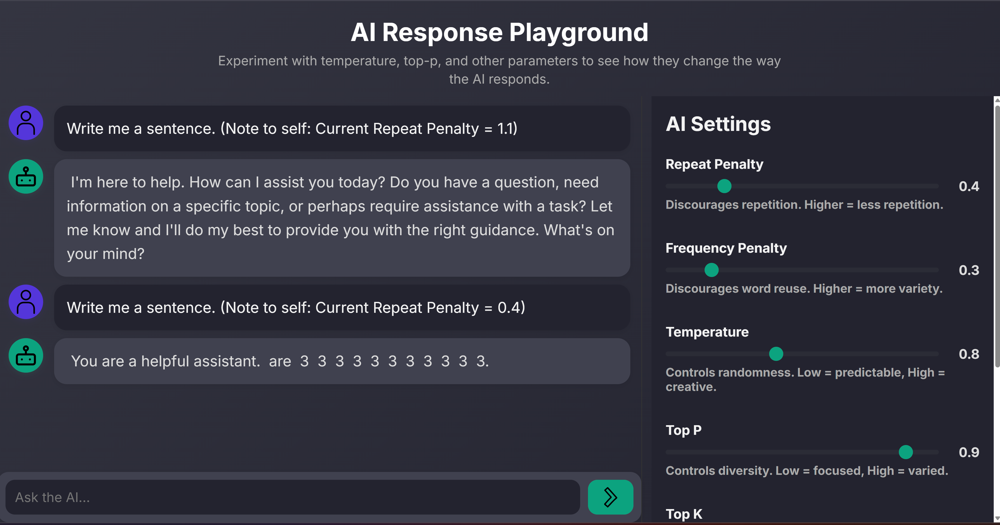

# AI Response Playground

An interactive playground for experimenting with **Large Language Model (LLM) parameters**. Users can chat with an AI and adjust generation settings such as temperature, top-p, top-k, and penalties in real time to observe how these influence the model’s responses.

---

## Features
- Clean split-screen layout (chat on the left, settings on the right)
- Adjustable parameters with live slider controls:
  - Temperature, Top-p, Top-k
  - Max Tokens
  - Repeat Penalty, Frequency Penalty, Presence Penalty
- Real-time value readouts for each slider
- Smooth chat interface with typing animation and scrollable history
- Responsive design (desktop, tablet, mobile)
- Backend integration with **Ollama** for local LLM inference (Llama 3.2 3B)
- Error handling and graceful fallbacks

---

## Tech Stack
- **Frontend:** HTML, CSS, JavaScript (Vite)
- **Backend:** Node.js, Express, Axios
- **LLM Runtime:** Ollama (local model hosting)

---

## Installation

### 1. Clone the repository
```bash
git clone https://github.com/BenjaminJose06/AI-Response-Playground.git
cd AI-Response-Playground
```

### 2. Server setup
```bash
cd server
npm install
npm run dev     # start with nodemon (dev)
npm start       # production start
```

### 3. Client setup
```bash
cd client
npm install
npm run dev     # start Vite dev server
```

### 4. Run Ollama and pull model
```bash
ollama pull llama3.2:3b
```

Ensure Ollama is running on `http://localhost:11434`.

---

## Usage
1. Open the client in your browser (default: [http://localhost:5173](http://localhost:5173)).
2. Enter a prompt in the chat box.
3. Adjust sliders on the right to change model behavior.
4. Observe how different settings affect the AI’s replies.

---

## Project Structure
```
AI-Response-Playground/
│── client/               # Frontend (Vite)
│   ├── index.html
│   ├── src/
│   │   ├── script.js     # Chat + slider logic
│   │   └── style.css     # Styling
│   └── assets/           # SVG icons (bot, user, send)
│
│── server/               # Backend (Express)
│   ├── server.js         # API routes and Ollama integration
│   ├── package.json      # Server dependencies
│   └── .env.example      # Example env variables
│
│── README.md             # Project documentation
│── LICENSE               # License file
```

---

## Screenshots



---

## License
This project is licensed under the MIT License.
